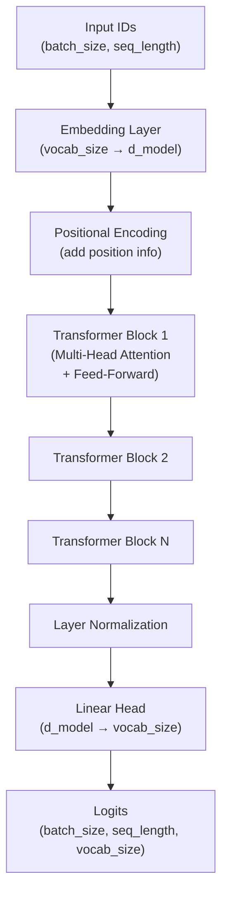
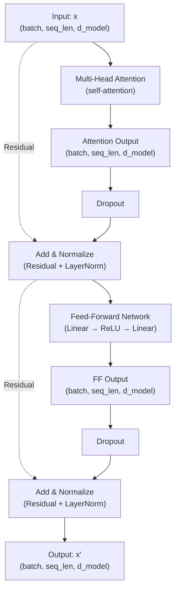
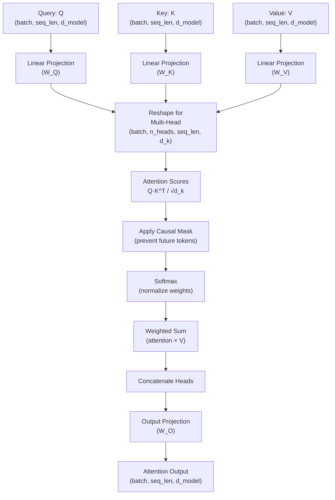
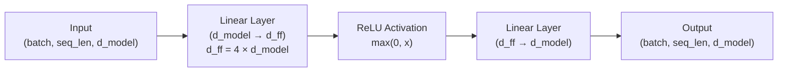
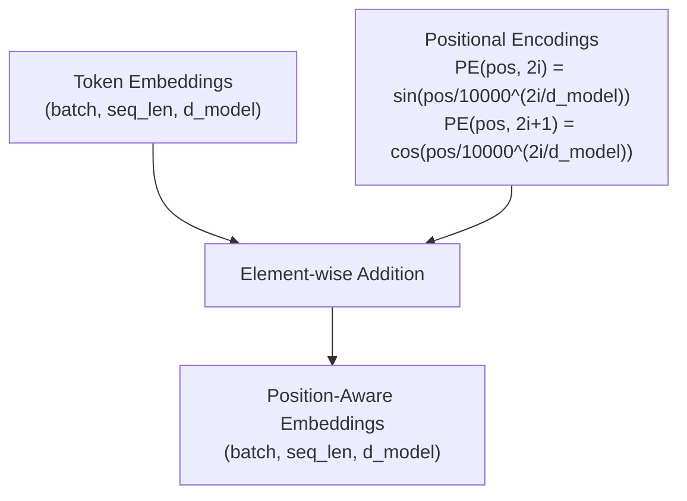
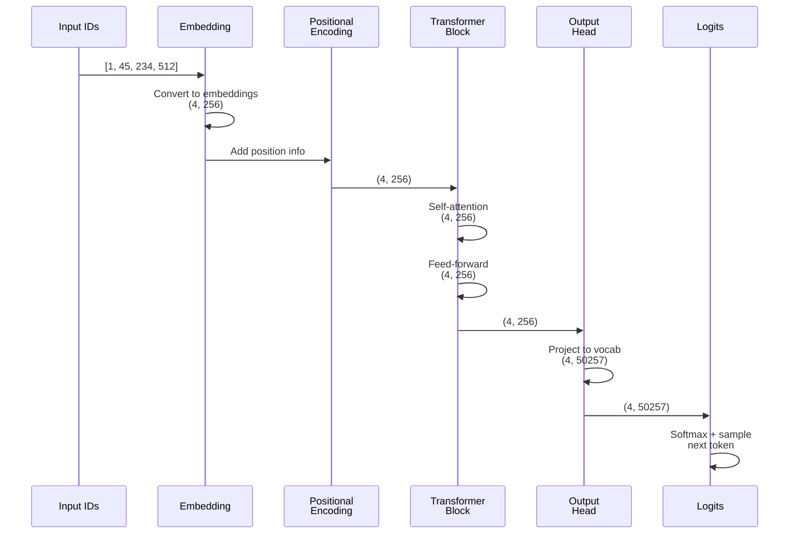
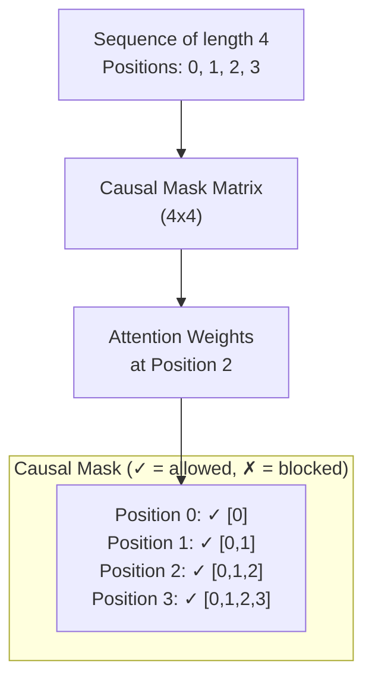
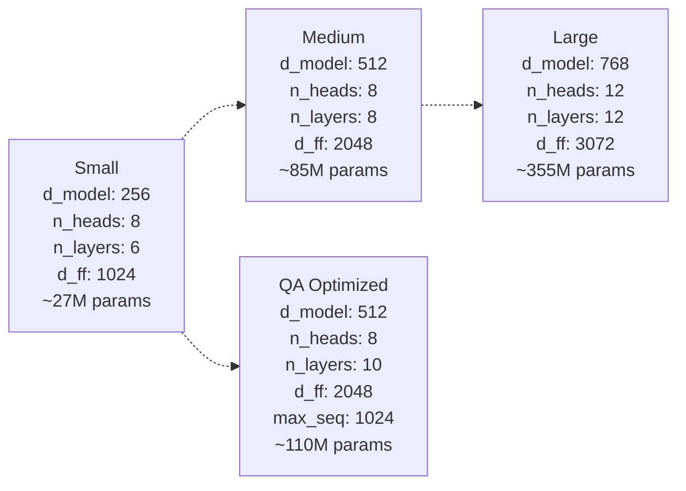
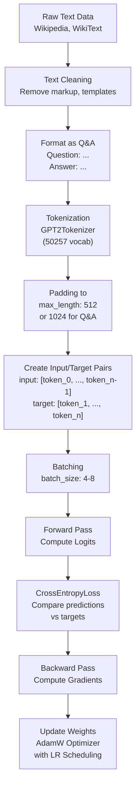
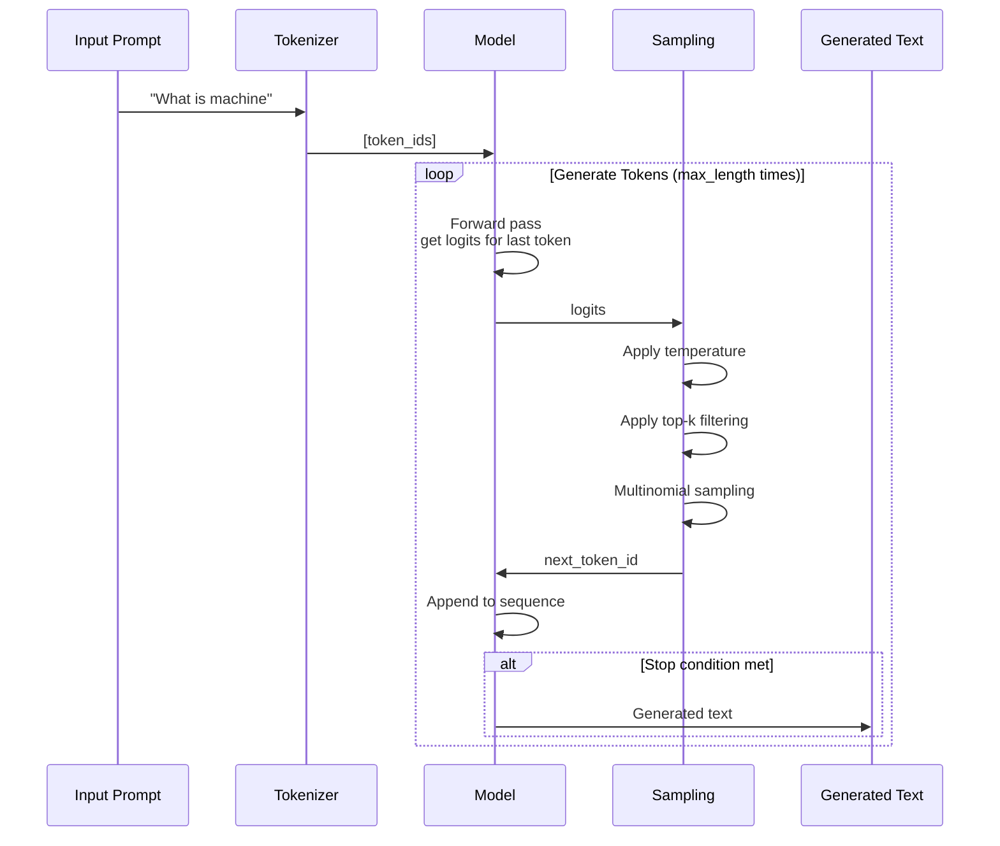

# DTL Architecture Documentation

This document provides visual and textual explanations of how the DTL transformer model works.

## High-Level Model Architecture

The TransformerLM is a decoder-only transformer designed for language modeling. Here's how data flows through the model:



## Transformer Block Deep Dive

Each transformer block consists of two main components: multi-head attention and a feed-forward network, both with residual connections and layer normalization.



## Multi-Head Attention Mechanism

Multi-head attention allows the model to attend to different representation subspaces. Here's how it works:



## Feed-Forward Network

Simple but effective network that processes each position independently:



## Positional Encoding

Since transformers have no built-in notion of sequence position, we add positional information using sinusoidal functions:



## Complete Forward Pass Example

Let's trace a single example through the entire model:



## Causal Masking (Autoregressive)

For language modeling, we prevent the model from seeing future tokens. This is done with causal masking in attention:



## Model Configuration Sizes

Different model configurations for different hardware constraints:



## Training Data Flow

How data flows through training:



## Generation Process

How the model generates new text token-by-token:



## Key Concepts

### Self-Attention
Each token can "attend to" all previous tokens in the sequence. The attention mechanism learns which tokens are most relevant for predicting the next token.

### Residual Connections
`x' = LayerNorm(x + f(x))` helps with training deep networks by allowing gradients to flow directly through skip connections.

### Layer Normalization
Normalizes activations across the d_model dimension, stabilizing training and improving convergence.

### Gradient Accumulation
Accumulates gradients over multiple batches before updating weights, effectively increasing batch size without requiring more GPU memory.

### Mixed Precision Training
Uses float16 for forward/backward passes (faster, less memory) but float32 for weight updates (more stable).

## Parameter Count Example

For the 'small' model with vocab_size=50257:

```
Embedding: 50257 × 256 = ~12.9M
Position Encoding: 5000 × 256 = ~1.3M (not counted in parameters)

Per Transformer Block:
  - Multi-Head Attention:
    - W_Q, W_K, W_V, W_O: 4 × (256 × 256) = ~262K
  - Feed-Forward:
    - Linear1: 256 × 1024 = ~262K
    - Linear2: 1024 × 256 = ~262K
  Total per block: ~786K

6 blocks: ~4.7M

Final LayerNorm: 256
Output Head: 256 × 50257 = ~12.9M

Total: ~12.9M + 4.7M + 12.9M ≈ 30.5M parameters
```

## Memory Requirements

During training with a batch of 8 sequences (256 tokens each):

```
Activations: 8 × 256 × d_model × num_blocks × 2 (forward + backward)
Parameters: model_params × (forward + backward + optimizer states)
KV Cache (inference): seq_len × 2 × num_layers × d_model (for generation)

Example (small model, batch_size=8):
Forward: ~2.5 GB
Backward: ~2.5 GB
Optimizer states: ~1.5 GB
Total: ~6.5 GB (RTX 4060 has 8GB)
```

